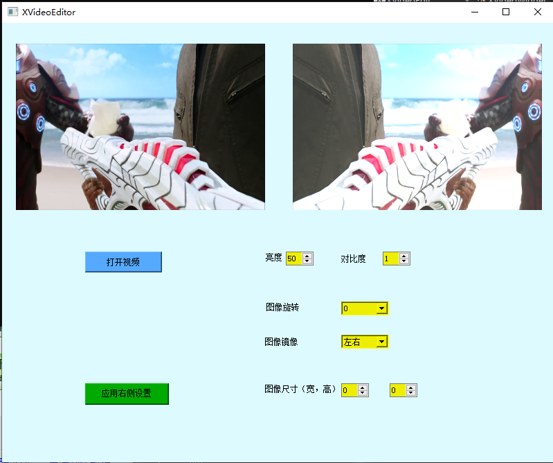

# 使用 OpenCV 编程

这个仓库主要使用的算法是基于 C++、Python 实现的，数字图像处理的基本内容和方法可以快速过一遍仓库 [image_digital_processing](https://github.com/hanxinle/image_digital_processing) 获取。

## 1 一些处理图像的示例

[程序链接](./src/opencv-examples),常见图像处理算法测试程序，便于查询调用。

## 2 OpenGL 控件显示图片

[程序链接](./src/qt-image-show/)，这个程序可以进一步扩展，实现更加复杂的功能。

## 3 视频编辑软件

